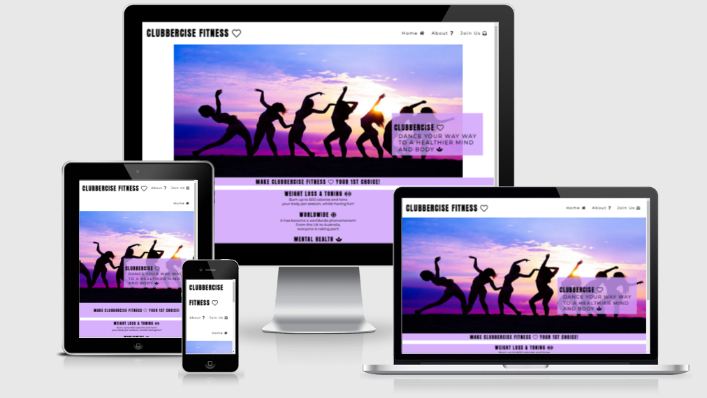
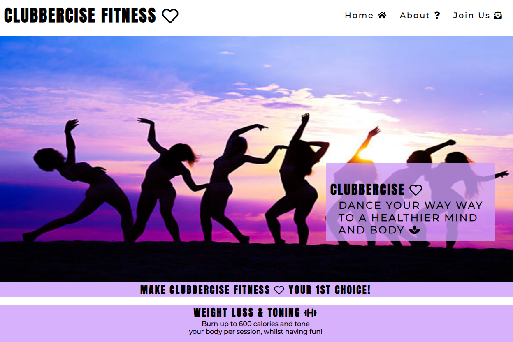
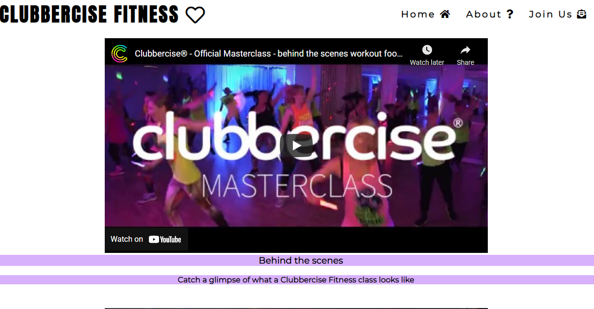
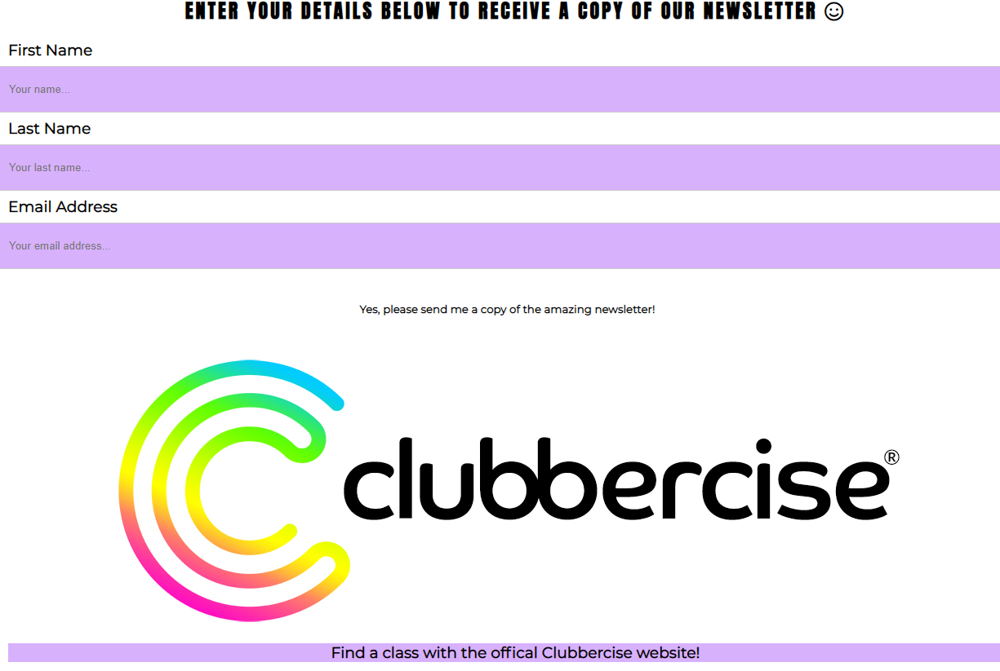
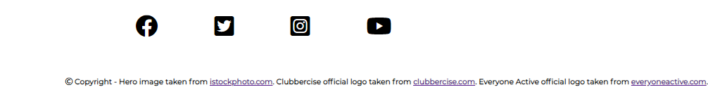
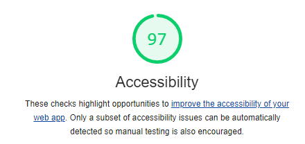

# Clubberise Fitness
###  This is a website that promotes Clubbercise.
 
 

Clubbercise is an exercise phenomenon that has taken the world by storm! The routines are much easier to follow than other dance workouts, can burn up to 600 calories per session and it takes place in the dark with glowsticks; you can really let yourself go!

This website is for those who would like to find out more about Clubbercise. People who may not enjoy fitness classes. Clubbercise is easily adapted to the users' needs and capabilities. The website details some of the benefits. There are videos that show what is involved. The user can even experience a class at home before joining a class. There is an inspirational story written by a user and a 3rd party article that really sells the benefits of dance-based-workouts. Users, new and experienced, can also use this website to locate a class nationally & locally. They can also sign up for a newsletter containing regular updates and offers relating to Clubbercise Fitness.

 
I really hope this website will show users how much fun and how beneficial to their wellbeing, this kind of exercise can be.

 
 

#### <b>Table of contents</b> 

<ol>
    <li><b>Home:</b> Hero image and promotion of Clubbercise. Social media links included within the footer.</li>
    <li><b>About:</b> Videos showing examples of Clubbercise, a Clubbercise class. A link to a user story and a link to an article that informs how Clubbercise has an impact of wellbeing. Social media links included within the footer.</li>
    <li><b>Join us:</b> Hero image advertising the newsletter. Sign up form to receive a newsletter. A link to the official Clubbercise website to find a class. A link to the official Everyone Active website to find a class. Social media links included within the footer.</li>
</ol>
 
 

#### <b>Technologies used</b>

HTML5 and CCS3
 
 

#### <b>Features</b>

<ol>
<li>The <b>nav bar</b> is present at the top of every page. This is to enable the user to easily navigate throughout the site, without the need of using the back button.</li>
 
 
<li>The <b>home page</b> purpose is to draw the users' attention to Clubbercise Fitness. This is done with the hero image and an animation of a text box to entice the user to a fun way of exercising. Below this I have highlighted some of the benefits of Clubbercise.</li>
 
 

 
 
<li>The <b>about page</b> is my opportunity to show what Clubbercise is, whilst allowing the user to make up their own mind regarding whether it is beneficial to them. It contains a 'behind the scenes' video for the user to view. It also has a video of a class that is led by Magna Vitae. These videos enable the user to take part from the comfort of their own home. There is a link to a story about a participant who went onto become an instructor, reaffirming the appeal that Clubbercise has over it's participants. The final link is to an artical, that was carried out by a 3rd party, which shows the evidence that has been gathered to support how dance fitness can improve mental wellbeing.</li>
 
 

 
 
<li>The <b>join us page</b> is where the user can register their contact details to receive a copy of the newsletter. This is for the user to receive special offers and regular information regarding Clubbercise. Below the sign-up form are links to the Clubbercise and Everyone Active official sites, that shows classes locally and nationally. These links go directly to these search/sign up pages for greater use for the user.</li>
 
 

 
 
<li>The <b>footer</b> is present at the bottom of every page. It contains social media links. This is beneficial to the user as they are links to the official social media accounts for Clubbercise. The user can go on to communicate with others, without leaving the main Clubbercise page. The footer also contains the copyright information for that page.</li>
 
 

 
 

#### <b>Additional Features - Future implementation</b>

I would like to add some form of fitness tracker for users to monitor their progress. It would be connected to devices that currently track a user's fitness (fitbit, phone etc...). The data would then be uploaded to the website for the user to track health and/or wellbeing.

I would like to add a page that is dedicated to posting official videos of classes for people to enjoy at home.
I would also like to add a comprehensive chatbox. Here I would like people to be able to post messages/photos/videos to an entire community of people. Here we can get real-time feedback on newsletters and videos posted. This chatbox could also serve as a 'suggestion box' for users to make requests.

When designing this site I took inspiration from the <a href="https://www.nike.com/gb/" target="_blank">Nike</a> and <a href="https://www.apple.com/" target="_blank">Apple</a> websites. I was struck by how minimalist they were. I don't quite feel I was able to accomplish this level of design. I do believe professional shots taken specifically for this website would result in a more aesthetically pleasing website.

 
 

#### <b>Testing</b>

All links have been checked. Some bugs appeared where links did not work or they went to a different website. These have all been resolved and tested again to show they are now correct. All links to external sites open in a new tab, the current page the user is on stays open. Both youtube videos open within the screen, they do not need a new page.

A bug within the navigation links was found relating to the home page. This has also been resolved.

Responsive design has been applied. It is readable on all devices. However, I do feel there is room for improvement around the styling. I have taken to learning more about this subject through with 
<a href="https://www.w3schools.com/html/html_responsive.asp" target="_blank">w3chools.com</a>. I would like to revisit this area, once I have a greater understanding, and improve upon the styling.

 
 

#### <b>Validator Testing</b>

<b>HTML - </b> No errors were returned when passing through the official <a href="https://validator.w3.org/nu/?doc=https%3A%2F%2Fkirstylfrost.github.io%2Fclubbercise_fitness%2F" target="_blank">html validator</a>.

<b>CSS - </b> No errors were found when passing through the official <a href="https://jigsaw.w3.org/css-validator/validator?uri=https%3A%2F%2Fkirstylfrost.github.io%2Fclubbercise_fitness%2F&profile=css3svg&usermedium=all&warning=1&vextwarning=&lang=en" target="_blank">jigsaw validator</a>.

<b>Lighthouse</b>

 
 

#### <b>Unfixed bugs</b>

All bugs were located and resolved when testing and passing through the validator.

 
 

#### <b>Deployment</b>

This site was deployed on GitHub, the following process shows how this was completed.
<ul>
  <li>In Github, go to the repository, select the settings tab.</li>
  <li>Go to the source drop down menu and select Master Branch.</li>
  <li>The page is then automatically refreshed and displays a message to state this has been deployed successfully.</li>
</ul>

Clubbercise Fitness live link - https://github.com/kirstylfrost/clubbercise_fitness 

 
 
 

#### <b>Credits</b>

I have used fontawesome throughout the project.

All images and videos are taken from public sources. Cited where applied at the bottom of each page within the copyright section.

I took inspiration from the love running project, although I made some changes. I liked the style of the header, so I implemented this style. I changed coding within the nav elements and added fontawesome text to style the element further.

I used the hero image and animation from the love running project, again I made some changes. I changed the animation to suit my site. Here I animated the cover text that is seen on the home and join us pages. 

Love Running live link - https://github.com/kirstylfrost/love-running

 
 

#### <b>Contents & Media</b>

The icons shown throughout the project were taken from <a href="https://fontawesome.com/" target="_blank">Font Awesome</a>.

Information taken from other sources is cited in the copyright section of each page. All other content is my own.

 
